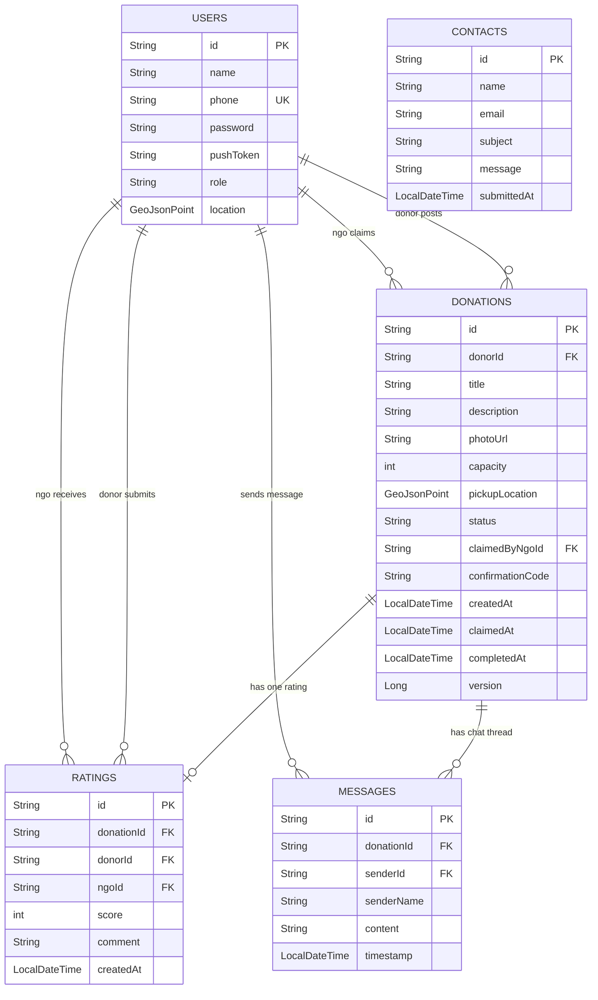

# Food Rescue — Database Diagram

## Overview

The application uses **MongoDB** as its database (`foodrescue`). All collections store documents in BSON format. Relationships between collections are maintained via **string ID references** (not embedded documents), consistent with a normalized NoSQL design.

---

## Entity Relationship Diagram



---

## Collections Detail

### `users`

| Field | Type | Constraints | Description |
|-------|------|-------------|-------------|
| `_id` | String (ObjectId) | Primary Key | Auto-generated MongoDB ID |
| `name` | String | Required | Display name of the user or organization |
| `phone` | String | Unique | Used as login identifier |
| `password` | String | Required | BCrypt hashed — never stored in plain text |
| `pushToken` | String | Optional | FCM device token for push notifications |
| `role` | Enum | Required | `DONOR` or `NGO` |
| `location` | GeoJsonPoint | Optional | `{ type: "Point", coordinates: [lon, lat] }` |

**Indexes:**
- `_id` — default primary index
- `location` — `2dsphere` geospatial index (for NGO proximity queries)
- `phone` — unique index (enforced at application level via `findByPhone`)

---

### `donations`

| Field | Type | Constraints | Description |
|-------|------|-------------|-------------|
| `_id` | String (ObjectId) | Primary Key | Auto-generated MongoDB ID |
| `donorId` | String | Required, FK → users._id | ID of the donor who posted |
| `title` | String | Required, 3–200 chars | Short description of the food |
| `description` | String | Optional, max 500 chars | Additional details (allergens, packaging, etc.) |
| `photoUrl` | String | Optional, max 500 chars | URL to food photo |
| `capacity` | int | Min 1, Max 100,000 | Estimated number of meals |
| `pickupLocation` | GeoJsonPoint | Required | `{ type: "Point", coordinates: [lon, lat] }` |
| `status` | Enum | Required | `AVAILABLE`, `CLAIMED`, `COMPLETED`, `CANCELLED` |
| `claimedByNgoId` | String | Optional, FK → users._id | Set when an NGO claims the donation |
| `confirmationCode` | String | 6-digit | SecureRandom code for pickup verification |
| `createdAt` | LocalDateTime | Auto-set | Timestamp when donation was posted |
| `claimedAt` | LocalDateTime | Optional | Timestamp when NGO claimed |
| `completedAt` | LocalDateTime | Optional | Timestamp when pickup was confirmed |
| `version` | Long | Auto-managed | Optimistic locking version field (`@Version`) |

**Indexes:**
- `_id` — default primary index
- `pickupLocation` — `2dsphere` geospatial index (for nearby donation queries)
- `status` — used in expiry queries and leaderboard aggregation
- Compound `(status, createdAt)` — used by `DonationExpiryService`

**State Machine:**
```
AVAILABLE ──claim──► CLAIMED ──complete──► COMPLETED
    │
    └──cancel/expire──► CANCELLED
```

---

### `ratings`

| Field | Type | Constraints | Description |
|-------|------|-------------|-------------|
| `_id` | String (ObjectId) | Primary Key | Auto-generated MongoDB ID |
| `donationId` | String | Required, FK → donations._id | The completed donation being rated |
| `donorId` | String | Required, FK → users._id | The donor submitting the rating |
| `ngoId` | String | Required, FK → users._id | The NGO being rated |
| `score` | int | Min 1, Max 5 | Star rating |
| `comment` | String | Optional, max 500 chars | Free-text feedback |
| `createdAt` | LocalDateTime | Auto-set | Timestamp of submission |

**Indexes:**
- `_id` — default primary index
- Compound unique index `(donationId, donorId)` — prevents duplicate ratings per donation per donor

---

### `messages`

| Field | Type | Constraints | Description |
|-------|------|-------------|-------------|
| `_id` | String (ObjectId) | Primary Key | Auto-generated MongoDB ID |
| `donationId` | String | Required, FK → donations._id | The donation this chat belongs to |
| `senderId` | String | Required, FK → users._id | ID of the message sender |
| `senderName` | String | Required | Display name of sender (denormalized for performance) |
| `content` | String | Required | Message text |
| `timestamp` | LocalDateTime | Auto-set | When the message was sent |

**Indexes:**
- `_id` — default primary index
- `donationId` — used by `findByDonationIdOrderByTimestampAsc` for chat history retrieval

---

### `contacts`

| Field | Type | Constraints | Description |
|-------|------|-------------|-------------|
| `_id` | String (ObjectId) | Primary Key | Auto-generated MongoDB ID |
| `name` | String | Required | Submitter's name |
| `email` | String | Required | Submitter's email address |
| `subject` | String | Required | Inquiry category |
| `message` | String | Required | Message body |
| `submittedAt` | LocalDateTime | Auto-set | Submission timestamp |

**Indexes:**
- `_id` — default primary index only (no queries beyond insert)

---

## Enumerations

### `Role`
| Value | Description |
|-------|-------------|
| `DONOR` | Food donor — restaurants, households, caterers |
| `NGO` | Non-governmental organization — collects and distributes food |

### `DonationStatus`
| Value | Description |
|-------|-------------|
| `AVAILABLE` | Posted and waiting to be claimed by an NGO |
| `CLAIMED` | An NGO has claimed it and is en route for pickup |
| `COMPLETED` | Pickup confirmed via 6-digit code — donation fulfilled |
| `CANCELLED` | Cancelled by donor or auto-expired after 4 hours |

---

## Relationships Summary

| From | To | Type | Via Field | Description |
|------|----|------|-----------|-------------|
| `users` | `donations` | One-to-Many | `donations.donorId` | A donor can post many donations |
| `users` | `donations` | One-to-Many | `donations.claimedByNgoId` | An NGO can claim many donations |
| `donations` | `ratings` | One-to-One | `ratings.donationId` | Each completed donation has at most one rating per donor |
| `users` | `ratings` | One-to-Many | `ratings.donorId` | A donor can submit ratings for multiple donations |
| `users` | `ratings` | One-to-Many | `ratings.ngoId` | An NGO can receive ratings from multiple donors |
| `donations` | `messages` | One-to-Many | `messages.donationId` | Each donation has a chat thread |
| `users` | `messages` | One-to-Many | `messages.senderId` | A user can send many messages |

---

## GeoJSON Point Structure

Both `users.location` and `donations.pickupLocation` use MongoDB's GeoJSON Point format:

```json
{
  "type": "Point",
  "coordinates": [longitude, latitude]
}
```

> Note: MongoDB GeoJSON uses `[longitude, latitude]` order (x, y), not the conventional `[latitude, longitude]`.

Both fields carry a `2dsphere` index enabling:
- `$geoNear` — find donations near a point
- `$geoWithin` — find NGOs within a radius
- Spring Data: `findByRoleAndLocationNear(role, point, distance)`

---

## Optimistic Locking

The `donations` collection uses MongoDB's optimistic locking via the `version` field (`@Version Long version`). When two NGOs attempt to claim the same donation simultaneously:

1. Both read the document at `version = N`
2. Both attempt to save with `version = N+1`
3. MongoDB's atomic compare-and-swap allows only one write to succeed
4. The second write throws `OptimisticLockingFailureException` → HTTP 409 Conflict

---

## Indexes Summary

| Collection | Field(s) | Index Type | Purpose |
|------------|----------|------------|---------|
| `users` | `_id` | Primary | Document lookup |
| `users` | `location` | 2dsphere | NGO proximity search |
| `donations` | `_id` | Primary | Document lookup |
| `donations` | `pickupLocation` | 2dsphere | Nearby donation search |
| `donations` | `status` | Single field | Status filtering |
| `donations` | `(status, createdAt)` | Compound | Expiry service query |
| `ratings` | `_id` | Primary | Document lookup |
| `ratings` | `(donationId, donorId)` | Compound Unique | Prevent duplicate ratings |
| `messages` | `_id` | Primary | Document lookup |
| `messages` | `donationId` | Single field | Chat history retrieval |
| `contacts` | `_id` | Primary | Document lookup |
